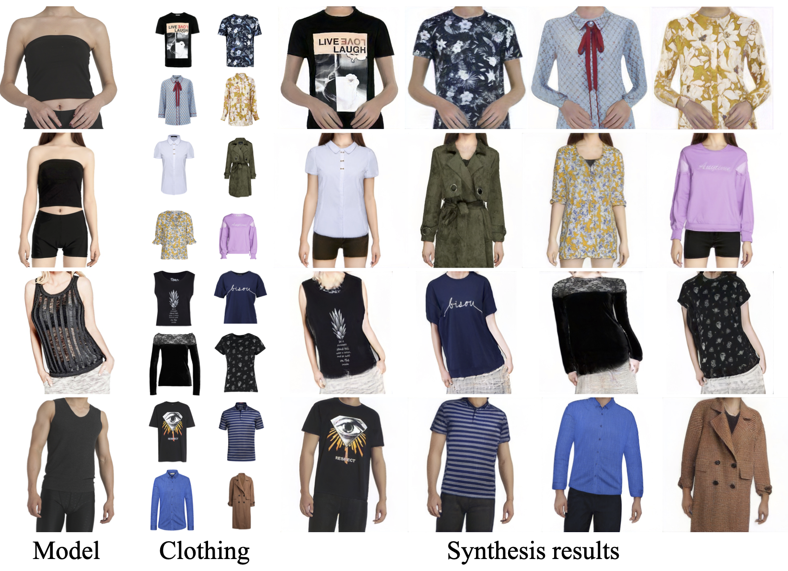

# DGP(Deep Generative Projection) - Official Tensorflow Implementation of CVPR2022 Paper Weakly Supervised High-Fidelity Clothing Model Generation
---
> ## Weakly Supervised High-Fidelity Clothing Model Generation
> In CVPR 2022<br>
> **Paper**: [https://arxiv.org/pdf/2112.07200.pdf](https://arxiv.org/pdf/2112.07200.pdf)<br>
> **Project Page**: [TODO](TODO)<br>
><br>
> **Abstract**: The development of online economics arouses the demand of generating images of models on product clothes, to display new clothes and promote sales. However, the expensive  proprietary model images challenge the existing image virtual try-on methods in this scenario, as most of them need to be trained on considerable amounts of model images accompanied with paired clothes images. In this paper, we propose a cheap yet scalable weakly-supervised method called Deep Generative Projection (DGP) to address this specific scenario. Lying in the heart of the proposed method is to imitate the process of human predicting the wearing effect, which is an unsupervised imagination based on life experience rather than computation rules learned from supervisions. Here a pretrained StyleGAN is used to capture the practical experience of wearing. Experiments show that projecting the rough alignment of clothing and body onto the StyleGAN space can yield photo-realistic wearing results. Experiments on real scene proprietary model images demonstrate the superiority of DGP over several state-of-the-art supervised methods when generating clothing model images.

## Installation
- Please refer to the requirements of [official stylegan2-tf](https://github.com/NVlabs/stylegan2) first (CUDA 10.0 toolkit, cuDNN 7.5 and TensorFlow 1.14)

- > pip install -r requirements.txt

## Dataset
- The ESF dataset will be released soon.<br>
- The CMI (Commercial Model Image) dataset cannot be released completely acoording to the copyright and the privacy issues. However we are trying to offer a small part for testing. As the CMI dataset is only a benchmark for evaluating our method, users may choose other public datasets (VTON, DeepFashion) for test.

## Dataset Preprocess
The data are organized as follows. Note each model contains a **model_info directory**, which contains cropped model image and corresponding parsing info. Each model has multiple **cloth directories**, which contains cloth img, cloth parse, coarse aligned img, and the resudial mask.

```
    ./data 
      |_model_1 
        |_model_info
          |_model_img.png
          |_model_parse.png
        |_cloth_1
          |_cloth_parse.png
          |_coarse_align.png
          |_residual_parse.png
        |_cloth_2
          ...
      |_model_2
        ...
```

We will release the related models and prepsocess scripts to get preprocessed data soon.

TODO List: 
- [ ] Release human parsing / keypoints model
- [ ] Release the clothing parsing / keypoints model
- [ ] Release the coarse alignment / crop script


## Pretrained models
download the [pretrained models zip file](https://zimutf.oss-cn-zhangjiakou.aliyuncs.com/CVPR22_DGP/pretrained_models.zip) and unzip to the current directory

> unzip pretrained_models.zip

you will get the following models:
- encoder-stylegan2-upper-body-512.pkl ( stylegan2 model with encoder, trained on ESF upper body dataset)
- vgg.h5 ( for calculating the perceptual loss )
- attributes_model_resnet101.h5 ( for calculating the attribute loss)


## Run the demo
> python deepGenPro.py --cloth_dir=./data/model_1/cloth_1/ --model_dir=./data/model_1/model_info/ --cloth_sleeve=short --output_dir=./output/

the results are in the save file:

<br>


